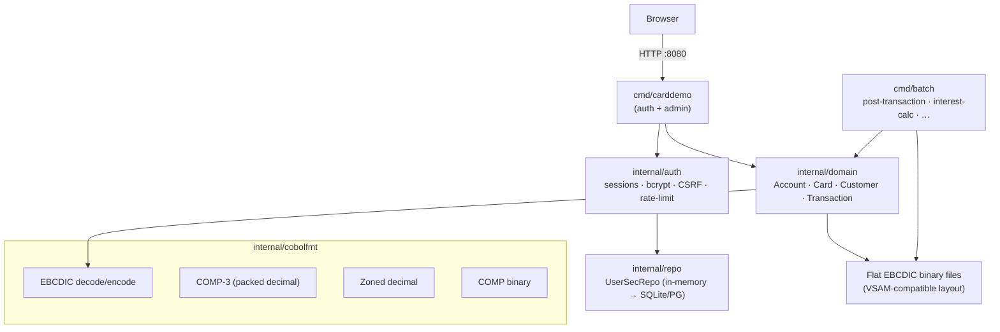

# CardDemo — Go Port

A faithful, modernised re-implementation of the [AWS Mainframe Modernization CardDemo](https://github.com/aws-samples/aws-mainframe-modernization-carddemo) reference application in Go. The original is a COBOL/CICS/VSAM credit-card management system; this port replaces each layer while preserving the data model and business logic so the two can be compared side-by-side.

```
module: github.com/aws-samples/aws-mainframe-modernization-carddemo
go:     1.26.4
```

---

## What this is

| COBOL layer | Go replacement |
|---|---|
| CICS online transactions (BMS screens) | `cmd/carddemo` HTTP server — `html/template` pages, session cookies |
| RACF user security + CICS sign-on | `internal/auth` — bcrypt, server-side sessions, CSRF, rate-limiting |
| VSAM KSDS / sequential datasets | Flat EBCDIC binary files (`internal/cobolfmt`) + repository interfaces (SQLite/Postgres planned, ADR 0004) |
| JCL batch job streams | `cmd/batch` subcommand CLI driven by `configs/orchestrator.yaml` |
| COMP-3 / zoned-decimal arithmetic | `github.com/shopspring/decimal` (ADR 0007) |

> **Implementation status.** The auth, user-management, and COBOL-format layers are complete and tested. The full BMS-screen web layer (`cmd/web`) and the 12 batch subcommands (`cmd/batch`) are stubs being wired up in RAU-43 and RAU-44 respectively. The COBOL flat-file data structures are fully defined and round-trip tested.

---

## Architecture



---

## Prerequisites

- Go 1.26.4 or later (`go version`)
- `make` (optional but used throughout this guide)

---

## Quick start

```bash
# 1. Clone
git clone https://github.com/aws-samples/aws-mainframe-modernization-carddemo.git
cd aws-mainframe-modernization-carddemo

# 2. Build everything
make build

# 3. Start the auth + admin server (seeds ADMIN001 / USER0001 automatically)
#    NOTE: `make run-web` starts cmd/web — a health-check-only stub pending RAU-43.
#    The working login binary today is cmd/carddemo:
go run ./cmd/carddemo
# → carddemo listening on :8080

# 4. Open http://localhost:8080/login
#    Log in as ADMIN001 / PASSWORD  (admin)
#    Log in as USER0001 / PASSWORD  (regular user)
```

To override the listen address:

```bash
CARDDEMO_ADDR=:9090 go run ./cmd/carddemo
```

---

## Default credentials

| User ID | Password | Role | Legacy equivalent |
|---|---|---|---|
| `ADMIN001` | `PASSWORD` | Admin | ADMIN001 in `AWS.M2.CARDDEMO.USRSEC.PS` |
| `USER0001` | `PASSWORD` | Regular user | USER0001 in `AWS.M2.CARDDEMO.USRSEC.PS` |

Users are seeded at server startup via `internal/auth.SeedDefaultUsers`. Passwords are stored as bcrypt hashes; the plaintext `PASSWORD` only appears at seed time and is never persisted.

---

## Running batch jobs

The `cmd/batch` binary maps each legacy JCL step to a named subcommand:

```bash
# List all subcommands
go run ./cmd/batch --help

# Run a single step
go run ./cmd/batch post-transaction --input /data/transactions/daily.dat
go run ./cmd/batch interest-calc --month current

# Run a multi-step job using the orchestrator config
cp configs/orchestrator.yaml.example configs/orchestrator.yaml
# edit paths as needed, then:
go run ./cmd/batch run --config configs/orchestrator.yaml --job daily-transaction-processing
```

Full JCL-to-subcommand mapping: [docs/migration-guide.md — JCL mapping](docs/migration-guide.md#jcl-to-subcommand-mapping)

---

## Data model

The Go domain types in `internal/domain/` are byte-for-byte compatible with the original VSAM and sequential dataset layouts. Each struct field carries a `cobol:"FIELD-NAME,offset,length,encoding"` tag that names the originating copybook field.

| Go struct | COBOL copybook | Record length | Dataset |
|---|---|---|---|
| `AccountRecord` | `CVACT01Y.cpy` | 300 bytes | `CARDDEMO.ACCTDATA.PS` |
| `CardRecord` | `CVACT02Y.cpy` | 150 bytes | `CARDDEMO.CARDDATA.PS` |
| `CardXrefRecord` | `CVACT03Y.cpy` | 50 bytes | `CARDDEMO.CARDXREF.PS` |
| `CustomerRecord` | `CVCUS01Y.cpy` / `CUSTREC.cpy` | 500 bytes | `CARDDEMO.CUSTDATA.PS` |
| `TransactionRecord` | `CVTRA05Y.cpy` | 350 bytes | `CARDDEMO.TRANSACT.VSAM.KSDS` |
| `DailyTransactionRecord` | `CVTRA06Y.cpy` | 350 bytes | `CARDDEMO.DALYTRAN.PS` |
| `TranTypeRecord` | `CVTRA03Y.cpy` | 60 bytes | `CARDDEMO.TRANTYPE.PS` |
| `TranCatRecord` | `CVTRA04Y.cpy` | 60 bytes | `CARDDEMO.TRANCATG.PS` |
| `TranCatBalRecord` | `CVTRA01Y.cpy` | 50 bytes | `CARDDEMO.TCATBALF.PS` |
| `DiscGroupRecord` | `CVTRA02Y.cpy` | 50 bytes | `CARDDEMO.DISCGRP.PS` |
| `UserSecRecord` | `CSUSR01Y.cpy` | 80 bytes | `CARDDEMO.USRSEC.PS` |

Full field-by-field mapping: [docs/migration-guide.md — Copybook mapping](docs/migration-guide.md#copybook-to-go-struct-mapping)

---

## HTTP routes

The current `cmd/carddemo` server exposes:

| Method | Path | Auth | Function |
|---|---|---|---|
| `GET` | `/login` | public | Sign-in form |
| `POST` | `/login` | public | Authenticate, set session cookie |
| `POST` | `/logout` | session | Destroy session |
| `GET` | `/admin/users` | admin | List users |
| `POST` | `/admin/users` | admin | Create user |
| `GET` | `/admin/users/{id}` | admin | View user |
| `POST` | `/admin/users/{id}` | admin | Update user |
| `POST` | `/admin/users/{id}/delete` | admin | Delete user |

Full BMS-screen-to-route mapping: [docs/migration-guide.md — Online transactions](docs/migration-guide.md#online-transaction-mapping)

---

## Development

```bash
make test       # run the full test suite
make lint       # golangci-lint
make vet        # go vet
make tidy       # go mod tidy

# Disable the Secure cookie flag for local HTTP testing
CARDDEMO_INSECURE_COOKIES=1 go run ./cmd/carddemo
```

---

## Documentation

| Document | Contents |
|---|---|
| [docs/adr/README.md](docs/adr/README.md) | Architectural decision records index |
| [docs/migration-guide.md](docs/migration-guide.md) | COBOL→Go: program, copybook, and JCL mapping |
| [docs/operations/runbook.md](docs/operations/runbook.md) | Seed, run, restore, troubleshoot |
| [docs/security/threat-model.md](docs/security/threat-model.md) | Security threat model |
| [docs/security/findings.md](docs/security/findings.md) | Security review findings and mitigations |

---

## License

Apache 2.0 — see [LICENSE](LICENSE).
