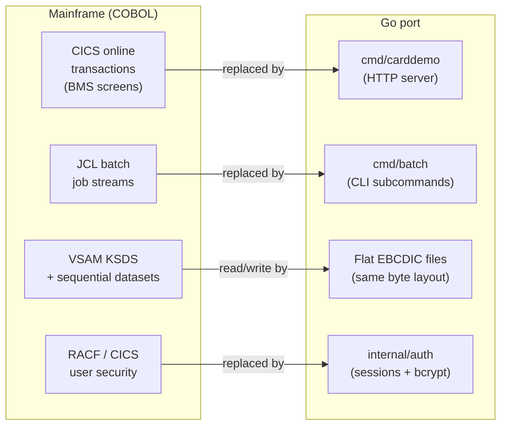
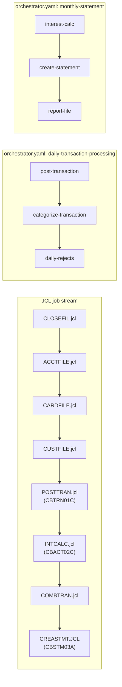

# CardDemo Migration Guide: COBOL → Go

This guide maps every legacy artifact — COBOL program, copybook, and JCL job — to its Go equivalent. Use it to locate the Go code corresponding to a piece of mainframe behaviour, or to verify that a piece of COBOL logic has been faithfully ported.

---

## Table of contents

1. [Architecture overview](#architecture-overview)
2. [Online transaction mapping](#online-transaction-mapping)
3. [Batch program mapping](#batch-program-mapping)
4. [Utility and out-of-scope programs](#utility-and-out-of-scope-programs)
5. [JCL-to-subcommand mapping](#jcl-to-subcommand-mapping)
6. [Copybook-to-Go struct mapping](#copybook-to-go-struct-mapping)
7. [Data type mapping (COBOL → Go)](#data-type-mapping)
8. [Authentication migration](#authentication-migration)
9. [Persistence migration](#persistence-migration)

---

## Architecture overview



### Key design choices

- **Byte-compatible data files.** `internal/domain` structs use the exact same EBCDIC fixed-length layout as the original VSAM datasets. A file extracted from the mainframe can be read directly by the Go port without conversion.
- **No CICS runtime.** The HTTP server replaces CICS transaction routing; sessions replace CICS COMMAREA.
- **No JCL executor.** The batch CLI replaces JCL; a YAML orchestrator file replaces JCL DD cards and step sequencing.
- **Decimal precision preserved.** `github.com/shopspring/decimal` replaces COMP-3 and zoned-decimal arithmetic, maintaining exact decimal semantics (no `float64` for money).

---

## Online transaction mapping

The CICS online system used 3- or 4-character transaction IDs and BMS map names. The Go port replaces each with an HTTP route backed by an `html/template` file.

```mermaid
flowchart TD
    CC00["CC00 / COSGN00C\nSignon Screen"] -->|GET /login\nPOST /login| GoLogin["GET /login\nPOST /login"]
    CM00["CM00 / COMEN01C\nMain Menu"] -->|planned RAU-43| GoMenu["GET /menu"]
    CAVW["CAVW / COACTVWC\nAccount View"] -->|planned RAU-43| GoAcct["GET /accounts/{id}"]
    CAUP["CAUP / COACTUPC\nAccount Update"] -->|planned RAU-43| GoAcctUp["POST /accounts/{id}"]
    CCLI["CCLI / COCRDLIC\nCard List"] -->|planned RAU-43| GoCardList["GET /cards"]
    CCDL["CCDL / COCRDSLC\nCard View"] -->|planned RAU-43| GoCardView["GET /cards/{id}"]
    CCUP["CCUP / COCRDUPC\nCard Update"] -->|planned RAU-43| GoCardUp["POST /cards/{id}"]
    CT00["CT00 / COTRN00C\nTransaction List"] -->|planned RAU-43| GoTranList["GET /transactions"]
    CT01["CT01 / COTRN01C\nTransaction View"] -->|planned RAU-43| GoTranView["GET /transactions/{id}"]
    CT02["CT02 / COTRN02C\nTransaction Add"] -->|planned RAU-43| GoTranAdd["POST /transactions"]
    CR00["CR00 / CORPT00C\nReports"] -->|planned RAU-43| GoReport["GET /reports"]
    CB00["CB00 / COBIL00C\nBill Payment"] -->|planned RAU-43| GoBill["POST /payments"]
    CA00["CA00 / COADM01C\nAdmin Menu"] -->|implemented| GoAdmin["GET /admin/users"]
    CU00["CU00 / COUSR00C\nUser List"] -->|implemented| GoUserList["GET /admin/users"]
    CU01["CU01 / COUSR01C\nAdd User"] -->|implemented| GoUserAdd["POST /admin/users"]
    CU02["CU02 / COUSR02C\nUpdate User"] -->|implemented| GoUserUp["POST /admin/users/{id}"]
    CU03["CU03 / COUSR03C\nDelete User"] -->|implemented| GoUserDel["POST /admin/users/{id}/delete"]
```



### Full online transaction table

| CICS transaction | BMS map | COBOL program | Function | Go route | Status |
|---|---|---|---|---|---|
| `CC00` | `COSGN00` | `COSGN00C.cbl` | Sign-on | `GET /login`, `POST /login` | Implemented |
| `CM00` | `COMEN01` | `COMEN01C.cbl` | Main Menu | `GET /menu` | Planned (RAU-43) |
| `CAVW` | `COACTVW` | `COACTVWC.cbl` | Account View | `GET /accounts/{id}` | Planned (RAU-43) |
| `CAUP` | `COACTUP` | `COACTUPC.cbl` | Account Update | `POST /accounts/{id}` | Planned (RAU-43) |
| `CCLI` | `COCRDLI` | `COCRDLIC.cbl` | Credit Card List | `GET /cards` | Planned (RAU-43) |
| `CCDL` | `COCRDSL` | `COCRDSLC.cbl` | Credit Card View | `GET /cards/{id}` | Planned (RAU-43) |
| `CCUP` | `COCRDUP` | `COCRDUPC.cbl` | Credit Card Update | `POST /cards/{id}` | Planned (RAU-43) |
| `CT00` | `COTRN00` | `COTRN00C.cbl` | Transaction List | `GET /transactions` | Planned (RAU-43) |
| `CT01` | `COTRN01` | `COTRN01C.cbl` | Transaction View | `GET /transactions/{id}` | Planned (RAU-43) |
| `CT02` | `COTRN02` | `COTRN02C.cbl` | Transaction Add | `POST /transactions` | Planned (RAU-43) |
| `CR00` | `CORPT00` | `CORPT00C.cbl` | Transaction Reports | `GET /reports` | Planned (RAU-43) |
| `CB00` | `COBIL00` | `COBIL00C.cbl` | Bill Payment | `POST /payments` | Planned (RAU-43) |
| `CA00` | `COADM01` | `COADM01C.cbl` | Admin Menu | `GET /admin/users` | Implemented |
| `CU00` | `COUSR00` | `COUSR00C.cbl` | User List | `GET /admin/users` | Implemented |
| `CU01` | `COUSR01` | `COUSR01C.cbl` | Add User | `POST /admin/users` | Implemented |
| `CU02` | `COUSR02` | `COUSR02C.cbl` | Update User | `POST /admin/users/{id}` | Implemented |
| `CU03` | `COUSR03` | `COUSR03C.cbl` | Delete User | `POST /admin/users/{id}/delete` | Implemented |

---

## Batch program mapping

Each COBOL batch program is replaced by a Go function wired to a `cmd/batch` subcommand. The Go side reads and writes the same EBCDIC flat files the COBOL programs used.

| COBOL program | Function | Go subcommand | Go package | Status |
|---|---|---|---|---|
| `CBTRN01C.cbl` | Transaction posting | `post-transaction` | `internal/batch` | Stub (RAU-44) |
| `CBTRN02C.cbl` | Transaction categorisation | `categorize-transaction` | `internal/batch` | Stub (RAU-44) |
| `CBTRN03C.cbl` | Daily rejects report | `daily-rejects` | `internal/batch` | Stub (RAU-44) |
| `CBACT01C.cbl` | Account file refresh | `account-file` | `internal/batch` | Stub (RAU-44) |
| `CBACT02C.cbl` | Interest calculation | `interest-calc` | `internal/batch` | Stub (RAU-44) |
| `CBACT03C.cbl` | Transaction category balance | `tcat-balance` | `internal/batch` | Stub (RAU-44) |
| `CBACT04C.cbl` | Read account | `read-account` | `internal/batch` | Stub (RAU-44) |
| `CBCUS01C.cbl` | Customer file refresh | `customer-file` | `internal/batch` | Stub (RAU-44) |
| `CBSTM03A.CBL` | Create statement | `create-statement` | `internal/batch` | Stub (RAU-44) |
| `CBSTM03B.CBL` | Report file | `report-file` | `internal/batch` | Stub (RAU-44) |
| `CBEXPORT.cbl` | Data export | `export` | `internal/batch` | Stub (RAU-44) |
| `CBIMPORT.cbl` | Data import | `import` | `internal/batch` | Stub (RAU-44) |

---

## Utility and out-of-scope programs

The tables above cover the 29 programs that map directly to the base Go port (17 online + 12 batch). The remaining 15 programs fall into two categories: base utilities and optional-module programs. All 44 source files are accounted for below.

### Base utility programs (`app/cbl/`)

| COBOL program | Function | Go equivalent | Notes |
|---|---|---|---|
| `COBSWAIT.cbl` | Timer/wait utility | _(not ported)_ | Used by `WAITSTEP.jcl` to pause a job stream. Equivalent: `sleep` in a shell script or a scheduler delay. |
| `CSUTLDTC.cbl` | Date conversion utility | `internal/cobolfmt` | Date decode/encode logic is absorbed into `internal/cobolfmt/date.go`; no standalone binary. |

### Optional-module programs (not in scope for base port)

The CardDemo repo ships three optional modules — IMS/DB2/MQ authorizations, DB2 transaction types, and VSAM+MQ account extraction. None of these are included in the Go port's base scope.

#### `app/app-authorization-ims-db2-mq/cbl/` — Pending authorization module

| COBOL program | Function | Status |
|---|---|---|
| `COPAUS0C.cbl` | Pending Authorization Summary (CICS) | Not ported — optional module |
| `COPAUS1C.cbl` | Pending Authorization Details (CICS) | Not ported — optional module |
| `COPAUS2C.cbl` | Process Authorization Requests (CICS, MQ trigger) | Not ported — optional module |
| `COPAUA0C.cbl` | Authorization processing (CICS) | Not ported — optional module |
| `CBPAUP0C.cbl` | Batch purge of expired authorizations | Not ported — optional module |
| `PAUDBLOD.CBL` | IMS DB load utility | Not ported — optional module |
| `PAUDBUNL.CBL` | IMS DB unload utility | Not ported — optional module |
| `DBUNLDGS.CBL` | DB2 unload utility | Not ported — optional module |

#### `app/app-transaction-type-db2/cbl/` — DB2 transaction type management module

| COBOL program | Function | Status |
|---|---|---|
| `COTRTLIC.cbl` | Transaction Type List/Update/Delete (CICS, `CTLI`) | Not ported — optional module |
| `COTRTUPC.cbl` | Transaction Type Add/Edit (CICS, `CTTU`) | Not ported — optional module |
| `COBTUPDT.cbl` | Maintain transaction type table (batch `MNTTRDB2`) | Not ported — optional module |

#### `app/app-vsam-mq/cbl/` — MQ account extraction module

| COBOL program | Function | Status |
|---|---|---|
| `COACCT01.cbl` | Account details inquiry via MQ (`CDRA`) | Not ported — optional module |
| `CODATE01.cbl` | System date inquiry via MQ (`CDRD`) | Not ported — optional module |

---

## JCL-to-subcommand mapping

JCL job steps are replaced by `carddemo-batch <subcommand>` invocations. The orchestrator YAML (`configs/orchestrator.yaml`) sequences them into jobs, replacing the JCL job stream.



### Complete JCL-to-subcommand table

| JCL job | COBOL program | Go subcommand | Notes |
|---|---|---|---|
| `DUSRSECJ.jcl` | IEBGENER | _(seeded at startup)_ | `internal/auth.SeedDefaultUsers` replaces IEBGENER load |
| `ACCTFILE.jcl` | IDCAMS | `account-file` | Refreshes `ACCTDATA.PS` |
| `CARDFILE.jcl` | IDCAMS | _(part of `account-file`)_ | Refreshes `CARDDATA.PS` |
| `CUSTFILE.jcl` | IDCAMS | `customer-file` | Refreshes `CUSTDATA.PS` |
| `XREFFILE.jcl` | IDCAMS | _(part of `account-file`)_ | Refreshes `CARDXREF.PS` |
| `TRANFILE.jcl` | IDCAMS | `import` | Loads initial `TRANSACT.VSAM.KSDS` |
| `TRANCATG.jcl` | IDCAMS | `categorize-transaction` | Loads `TRANCATG.PS` |
| `TRANTYPE.jcl` | IDCAMS | _(part of `import`)_ | Loads `TRANTYPE.PS` |
| `DISCGRP.jcl` | IDCAMS | _(part of `import`)_ | Loads `DISCGRP.PS` |
| `TCATBALF.jcl` | IDCAMS | `tcat-balance` | Loads `TCATBALF.PS` |
| `POSTTRAN.jcl` | `CBTRN01C` | `post-transaction` | Core daily transaction processing |
| `INTCALC.jcl` | `CBACT04C` | `interest-calc` | Monthly interest calculation |
| `COMBTRAN.jcl` | SORT | _(part of `post-transaction`)_ | Merge DALYTRAN + TRANSACT |
| `CREASTMT.JCL` | `CBSTM03A` | `create-statement` | Generate account statement |
| `REPTFILE.jcl` | `CBSTM03B` | `report-file` | Generate report output |
| `TRANBKP.jcl` | IDCAMS | _(no direct equivalent)_ | Backup managed by external scheduler |
| `TRANIDX.jcl` | IDCAMS | _(handled by persistence layer)_ | AIX defined as SQL index in ADR 0004 |
| `DALYREJS.jcl` | `CBTRN03C` | `daily-rejects` | Daily reject report |
| `CBEXPORT.jcl` | `CBEXPORT` | `export` | Export to flat file |
| `CBIMPORT.jcl` | `CBIMPORT` | `import` | Import from flat file |
| `CLOSEFIL.jcl` | IEFBR14 | _(not needed)_ | VSAM file management; no Go equivalent |
| `OPENFIL.jcl` | IEFBR14 | _(not needed)_ | VSAM file management; no Go equivalent |
| `WAITSTEP.jcl` | `COBSWAIT` | _(use `sleep` or scheduler)_ | Step delay; handled by orchestrator |

---

## Copybook-to-Go struct mapping

Each COBOL copybook maps to a Go struct in `internal/domain/`. Every struct field carries a `cobol` struct tag encoding the exact byte layout from the copybook.

### CSUSR01Y.cpy → `UserSecRecord` and `UserSec`

The copybook maps to **two** Go types:

| Role | Type | File |
|---|---|---|
| Wire layout (EBCDIC flat file) | `domain.UserSecRecord` | `internal/domain/usersec_record.go` |
| Live domain model (bcrypt hash) | `domain.UserSec` | `internal/domain/usersec.go` |

> **Migration note:** `UserSecRecord.Password` holds the 8-char plaintext password as stored on the mainframe. When importing from a mainframe export, a password re-hash step must run: read each record's `SEC-USR-PWD`, hash it with bcrypt, store the hash in `UserSec.PwdHash`. The plaintext is never persisted in the Go port.

**`UserSecRecord`** (80 bytes, `CSUSR01Y.cpy`):

| Go field | COBOL name | PIC | Offset | Length | Go type |
|---|---|---|---|---|---|
| `UserID` | `SEC-USR-ID` | X(08) | 0 | 8 | `string` |
| `FirstName` | `SEC-USR-FNAME` | X(20) | 8 | 20 | `string` |
| `LastName` | `SEC-USR-LNAME` | X(20) | 28 | 20 | `string` |
| `Password` | `SEC-USR-PWD` | X(08) | 48 | 8 | `string` (plaintext on mainframe) |
| `UserType` | `SEC-USR-TYPE` | X(01) | 56 | 1 | `string` (`'A'`=admin, `'U'`=user) |
| _(filler)_ | — | X(23) | 57 | 23 | — |

---

### CVACT01Y.cpy → `AccountRecord` (300 bytes)

| Go field | COBOL name | PIC | Offset | Length | Go type |
|---|---|---|---|---|---|
| `AcctID` | `ACCT-ID` | 9(11) | 0 | 11 | `int64` |
| `AcctActiveStatus` | `ACCT-ACTIVE-STATUS` | X(01) | 11 | 1 | `string` |
| `AcctCurrBal` | `ACCT-CURR-BAL` | S9(10)V99 | 12 | 12 | `decimal.Decimal` |
| `AcctCreditLimit` | `ACCT-CREDIT-LIMIT` | S9(10)V99 | 24 | 12 | `decimal.Decimal` |
| `AcctCashCreditLimit` | `ACCT-CASH-CREDIT-LIMIT` | S9(10)V99 | 36 | 12 | `decimal.Decimal` |
| `AcctOpenDate` | `ACCT-OPEN-DATE` | X(10) YYYY-MM-DD | 48 | 10 | `string` |
| `AcctExpirationDate` | `ACCT-EXPIRAION-DATE`* | X(10) YYYY-MM-DD | 58 | 10 | `string` |
| `AcctReissueDate` | `ACCT-REISSUE-DATE` | X(10) YYYY-MM-DD | 68 | 10 | `string` |
| `AcctCurrCycCredit` | `ACCT-CURR-CYC-CREDIT` | S9(10)V99 | 78 | 12 | `decimal.Decimal` |
| `AcctCurrCycDebit` | `ACCT-CURR-CYC-DEBIT` | S9(10)V99 | 90 | 12 | `decimal.Decimal` |
| `AcctAddrZip` | `ACCT-ADDR-ZIP` | X(10) | 102 | 10 | `string` |
| `AcctGroupID` | `ACCT-GROUP-ID` | X(10) | 112 | 10 | `string` |
| _(filler)_ | — | X(178) | 122 | 178 | — |

\* Typo `EXPIRAION` (missing T) is preserved from the original copybook.

---

### CVACT02Y.cpy → `CardRecord` (150 bytes)

| Go field | COBOL name | PIC | Offset | Length | Go type |
|---|---|---|---|---|---|
| `CardNum` | `CARD-NUM` | X(16) | 0 | 16 | `string` |
| `CardAcctID` | `CARD-ACCT-ID` | 9(11) | 16 | 11 | `int64` |
| `CardCVVCode` | `CARD-CVV-CD` | 9(03) | 27 | 3 | `int64` |
| `CardEmbossedName` | `CARD-EMBOSSED-NAME` | X(50) | 30 | 50 | `string` |
| `CardExpirationDate` | `CARD-EXPIRAION-DATE`* | X(10) YYYY-MM-DD | 80 | 10 | `string` |
| `CardActiveStatus` | `CARD-ACTIVE-STATUS` | X(01) | 90 | 1 | `string` |
| _(filler)_ | — | X(59) | 91 | 59 | — |

\* Same typo as `AccountRecord`.

---

### CVACT03Y.cpy → `CardXrefRecord` (50 bytes)

| Go field | COBOL name | PIC | Offset | Length | Go type |
|---|---|---|---|---|---|
| `XrefCardNum` | `XREF-CARD-NUM` | X(16) | 0 | 16 | `string` |
| `XrefCustID` | `XREF-CUST-ID` | 9(09) | 16 | 9 | `int64` |
| `XrefAcctID` | `XREF-ACCT-ID` | 9(11) | 25 | 11 | `int64` |
| _(filler)_ | — | X(14) | 36 | 14 | — |

---

### CVCUS01Y.cpy / CUSTREC.cpy → `CustomerRecord` (500 bytes)

| Go field | COBOL name | PIC | Offset | Length | Go type |
|---|---|---|---|---|---|
| `CustID` | `CUST-ID` | 9(09) | 0 | 9 | `int64` |
| `CustFirstName` | `CUST-FIRST-NAME` | X(25) | 9 | 25 | `string` |
| `CustMiddleName` | `CUST-MIDDLE-NAME` | X(25) | 34 | 25 | `string` |
| `CustLastName` | `CUST-LAST-NAME` | X(25) | 59 | 25 | `string` |
| `CustAddrLine1` | `CUST-ADDR-LINE-1` | X(50) | 84 | 50 | `string` |
| `CustAddrLine2` | `CUST-ADDR-LINE-2` | X(50) | 134 | 50 | `string` |
| `CustAddrLine3` | `CUST-ADDR-LINE-3` | X(50) | 184 | 50 | `string` |
| `CustAddrStateCode` | `CUST-ADDR-STATE-CD` | X(02) | 234 | 2 | `string` |
| `CustAddrCountryCode` | `CUST-ADDR-COUNTRY-CD` | X(03) | 236 | 3 | `string` |
| `CustAddrZip` | `CUST-ADDR-ZIP` | X(10) | 239 | 10 | `string` |
| `CustPhoneNum1` | `CUST-PHONE-NUM-1` | X(15) | 249 | 15 | `string` |
| `CustPhoneNum2` | `CUST-PHONE-NUM-2` | X(15) | 264 | 15 | `string` |
| `CustSSN` | `CUST-SSN` | 9(09) | 279 | 9 | `int64` |
| `CustGovtIssuedID` | `CUST-GOVT-ISSUED-ID` | X(20) | 288 | 20 | `string` |
| `CustDOB` | `CUST-DOB-YYYY-MM-DD` | X(10) YYYY-MM-DD | 308 | 10 | `string` |
| `CustEFTAccountID` | `CUST-EFT-ACCOUNT-ID` | X(10) | 318 | 10 | `string` |
| `CustPriCardHolderInd` | `CUST-PRI-CARD-HOLDER-IND` | X(01) | 328 | 1 | `string` |
| `CustFICOCreditScore` | `CUST-FICO-CREDIT-SCORE` | 9(03) | 329 | 3 | `int64` |
| _(filler)_ | — | X(168) | 332 | 168 | — |

---

### CVTRA05Y.cpy → `TransactionRecord` (350 bytes)

| Go field | COBOL name | PIC | Offset | Length | Go type |
|---|---|---|---|---|---|
| `TranID` | `TRAN-ID` | X(16) | 0 | 16 | `string` |
| `TranTypeCode` | `TRAN-TYPE-CD` | X(02) | 16 | 2 | `string` |
| `TranCatCode` | `TRAN-CAT-CD` | 9(04) | 18 | 4 | `int64` |
| `TranSource` | `TRAN-SOURCE` | X(10) | 22 | 10 | `string` |
| `TranDesc` | `TRAN-DESC` | X(100) | 32 | 100 | `string` |
| `TranAmt` | `TRAN-AMT` | S9(09)V99 | 132 | 11 | `decimal.Decimal` |
| `TranMerchantID` | `TRAN-MERCHANT-ID` | 9(09) | 143 | 9 | `int64` |
| `TranMerchantName` | `TRAN-MERCHANT-NAME` | X(50) | 152 | 50 | `string` |
| `TranMerchantCity` | `TRAN-MERCHANT-CITY` | X(50) | 202 | 50 | `string` |
| `TranMerchantZip` | `TRAN-MERCHANT-ZIP` | X(10) | 252 | 10 | `string` |
| `TranCardNum` | `TRAN-CARD-NUM` | X(16) | 262 | 16 | `string` |
| `TranOrigTS` | `TRAN-ORIG-TS` | X(26) | 278 | 26 | `string` |
| `TranProcTS` | `TRAN-PROC-TS` | X(26) | 304 | 26 | `string` |
| _(filler)_ | — | X(20) | 330 | 20 | — |

> `CVTRA06Y.cpy` (`DailyTransactionRecord`) has an identical layout but with `DALYTRAN-` prefixed field names. The two represent the VSAM online store vs. the daily sequential file.

---

### CVTRA03Y.cpy → `TranTypeRecord` (60 bytes)

| Go field | COBOL name | PIC | Offset | Length | Go type |
|---|---|---|---|---|---|
| `TranType` | `TRAN-TYPE` | X(02) | 0 | 2 | `string` |
| `TranTypeDesc` | `TRAN-TYPE-DESC` | X(50) | 2 | 50 | `string` |
| _(filler)_ | — | X(08) | 52 | 8 | — |

---

### CVTRA04Y.cpy → `TranCatRecord` (60 bytes)

| Go field | COBOL name | PIC | Offset | Length | Go type |
|---|---|---|---|---|---|
| `TranTypeCode` | `TRAN-TYPE-CD` | X(02) | 0 | 2 | `string` |
| `TranCatCode` | `TRAN-CAT-CD` | 9(04) | 2 | 4 | `int64` |
| `TranCatTypeDesc` | `TRAN-CAT-TYPE-DESC` | X(50) | 6 | 50 | `string` |
| _(filler)_ | — | X(04) | 56 | 4 | — |

---

### CVTRA01Y.cpy → `TranCatBalRecord` (50 bytes)

| Go field | COBOL name | PIC | Offset | Length | Go type |
|---|---|---|---|---|---|
| `TrancatAcctID` | `TRANCAT-ACCT-ID` | 9(11) | 0 | 11 | `int64` |
| `TrancatTypeCD` | `TRANCAT-TYPE-CD` | X(02) | 11 | 2 | `string` |
| `TrancatCode` | `TRANCAT-CD` | 9(04) | 13 | 4 | `int64` |
| `TranCatBalance` | `TRAN-CAT-BAL` | S9(09)V99 | 17 | 11 | `decimal.Decimal` |
| _(filler)_ | — | X(22) | 28 | 22 | — |

---

### CVTRA02Y.cpy → `DiscGroupRecord` (50 bytes)

| Go field | COBOL name | PIC | Offset | Length | Go type |
|---|---|---|---|---|---|
| `DisAcctGroupID` | `DIS-ACCT-GROUP-ID` | X(10) | 0 | 10 | `string` |
| `DisTranTypeCD` | `DIS-TRAN-TYPE-CD` | X(02) | 10 | 2 | `string` |
| `DisTranCatCode` | `DIS-TRAN-CAT-CD` | 9(04) | 12 | 4 | `int64` |
| `DisIntRate` | `DIS-INT-RATE` | S9(04)V99 | 16 | 6 | `decimal.Decimal` |
| _(filler)_ | — | X(28) | 22 | 28 | — |

---

## Data type mapping

| COBOL PIC clause | Encoding | Go type | Package |
|---|---|---|---|
| `PIC X(n)` alphanumeric | EBCDIC, space-padded | `string` (trimmed) | `internal/cobolfmt` EBCDIC |
| `PIC 9(n)` unsigned integer | Zoned decimal (EBCDIC digits) | `int64` | `internal/cobolfmt` zoned |
| `PIC S9(n)Vpp` signed decimal | Zoned decimal with implied decimal | `decimal.Decimal` | `internal/cobolfmt` zoned |
| `PIC S9(n)V99 COMP-3` packed | Packed BCD (COMP-3) | `decimal.Decimal` | `internal/cobolfmt` packed |
| `PIC 9(n) COMP` binary | Big-endian binary | `int64` / `uint32` | `internal/cobolfmt` binary |
| Date fields `X(10) YYYY-MM-DD` | EBCDIC alphanumeric | `string` | same |
| Timestamp fields `X(26)` | EBCDIC alphanumeric | `string` | — |

### Why `decimal.Decimal` not `float64`

COBOL zoned and packed decimal types are exact base-10 representations. Converting to `float64` introduces rounding errors on values like `$0.10`. `decimal.Decimal` (from `github.com/shopspring/decimal`) preserves exact decimal semantics. `float64` is banned for monetary fields (ADR 0007).

---

## Authentication migration

| Mainframe mechanism | Go replacement |
|---|---|
| RACF user registry | `internal/repo.InMemoryUserSec` (→ SQLite/Postgres per ADR 0004) |
| RACF plaintext password (8 chars, `SEC-USR-PWD`) | bcrypt hash in `UserSec.PwdHash` |
| CICS transaction security (TRANSEC) | HTTP session cookie `carddemo_sid` + `RequireAdmin` middleware |
| CICS COMMAREA for inter-transaction state | In-process HTTP session store |
| No CSRF mechanism on 3270 | Double-submit CSRF cookie (`carddemo_csrf`) |
| No rate limiting | 5 attempts / 15 min per username; 20 attempts / 15 min per IP |

### Password migration from mainframe export

```
For each UserSecRecord in USRSEC.PS flat file:
  1. Decode the 80-byte EBCDIC record into UserSecRecord
  2. Read SEC-USR-PWD (bytes 48-55) as the plaintext password
  3. Hash it: hash, _ = bcrypt.GenerateFromPassword([]byte(pwd), bcrypt.DefaultCost)
  4. Store UserSec{UserID, FirstName, LastName, PwdHash: string(hash), Type}
  WARNING: discard the plaintext immediately after hashing
```

---

## Persistence migration

The VSAM KSDS datasets are replaced in two stages:

**Stage 1 (current):** Flat EBCDIC binary files. The Go structs read/write the same byte layout as the mainframe datasets. A file FTP-transferred from the mainframe can be used directly.

**Stage 2 (ADR 0004, planned):** Repository interfaces backed by SQLite (dev) or Postgres (prod). The flat files become an import/export format only.

| VSAM dataset | SQL table (planned) | Key |
|---|---|---|
| `CARDDEMO.ACCTDATA.PS` (KSDS) | `accounts` | `acct_id` |
| `CARDDEMO.CARDDATA.PS` (KSDS) | `cards` | `card_num` |
| `CARDDEMO.CARDXREF.PS` (KSDS) | `card_xref` | `card_num` |
| `CARDDEMO.CUSTDATA.PS` (KSDS) | `customers` | `cust_id` |
| `CARDDEMO.TRANSACT.VSAM.KSDS` (KSDS) | `transactions` | `card_num + tran_id` |
| `CARDDEMO.DALYTRAN.PS` (sequential) | `daily_transactions` | `tran_id` |
| `CARDDEMO.TRANTYPE.PS` (sequential) | `tran_types` | `tran_type` |
| `CARDDEMO.TRANCATG.PS` (sequential) | `tran_categories` | `tran_type_cd + tran_cat_cd` |
| `CARDDEMO.TCATBALF.PS` (sequential) | `tran_cat_balances` | `acct_id + type_cd + cat_cd` |
| `CARDDEMO.DISCGRP.PS` (sequential) | `disc_groups` | `acct_group_id + tran_type_cd + cat_cd` |
| `CARDDEMO.USRSEC.PS` (sequential) | `users` | `user_id` |

VSAM alternate indexes (AIX) on `TRANSACT.VSAM.KSDS` are replaced by SQL secondary indexes. The `TrnxRecord` type (key layout: `card_num + tran_id`) captures the AIX access pattern.
